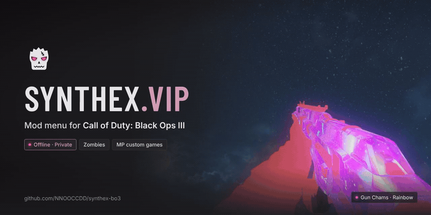
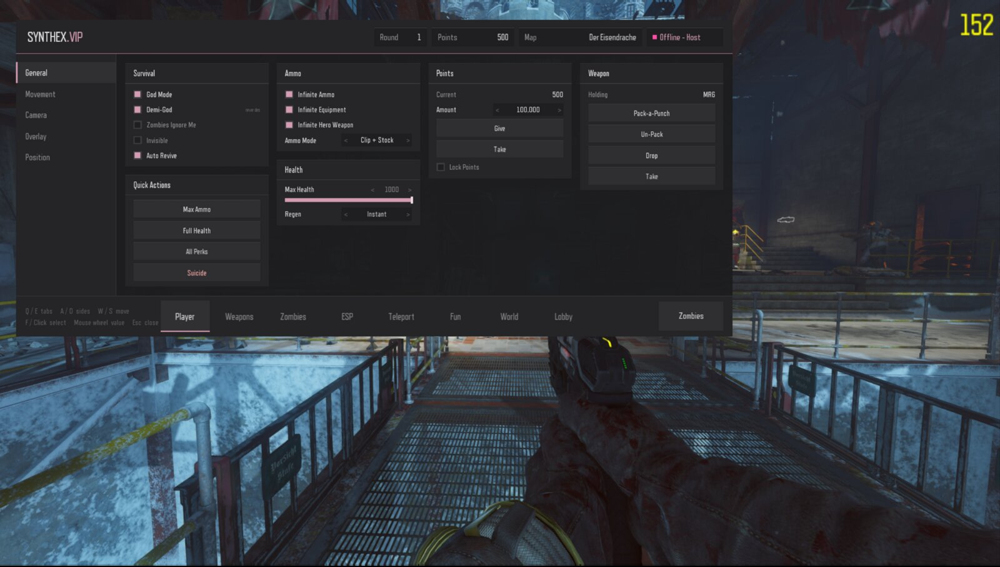
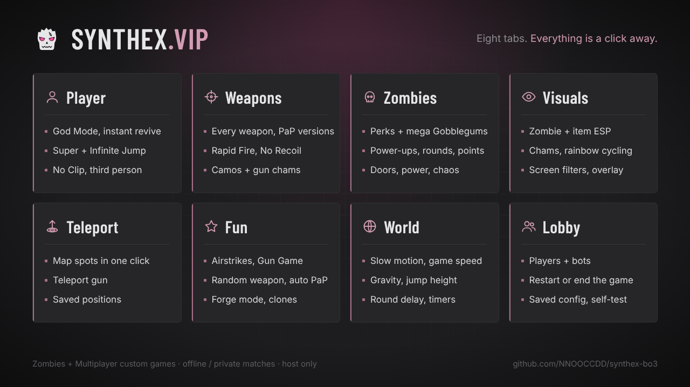
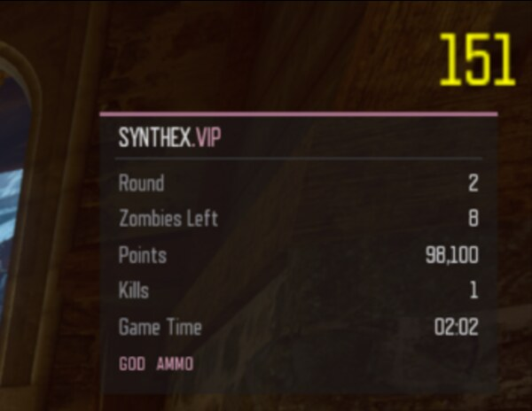

# SYNTHEX.VIP

An in-game mod menu for **Call of Duty: Black Ops III** — Zombies and Multiplayer custom games, offline or in
your own private matches. Mouse-driven, wide layout, dark charcoal + dusty pink.



> **Offline / private only.** The menu turns itself off in public matchmaking and only the host gets it.
> BO3 mods can't be loaded in public matches anyway. Please don't use it to ruin other people's games.

## Install (players)
1. Download `synthex-vip-<version>.zip` from [Releases](../../releases).
2. Unzip it into your Black Ops III folder so you end up with
   `Call of Duty Black Ops III/mods/synthex/zone/*.ff` (six `.ff` files).
   (Steam → right-click Black Ops III → Manage → Browse local files.)
3. Steam → right-click Black Ops III → Properties → Launch Options, add:
   ```
   +set fs_game synthex
   ```
   (If you already have launch options, put it after them, separated by a space.)
4. Start the game and play **Zombies** (solo/offline or a private game) or **Multiplayer custom games**.
   Campaign isn't supported.

To play without the mod again, remove `+set fs_game synthex` from the launch options.

## Using it
| | |
|---|---|
| **Open** | hold **Aim** and press **Melee** |
| **Close** | **V** or **Backspace** (controller: B) — not Esc, Esc opens the game's pause menu |
| **Mouse** | click tabs, side tabs, toggles, buttons and the `‹ ›` arrows on sliders |
| **Keys** | Q / E tabs · A / D side tabs · W / S move · F select · Z / X or mouse wheel change a value |

Settings save to disk under **Lobby → Menu** (`players/mods/synthex/synthex_config.txt`), with
**Auto-Load On Start** so your setup comes back every game. Zombies and Multiplayer are saved separately.

## Features


**Player** — **Survival**: God Mode, Demi-God, Zombies Ignore Me / Always UAV, Invisible, max health and regen,
instant revive and infinite downs, quick actions. **Movement**: speed, Super Jump, Infinite Jump, double jump
anywhere, No Clip fly. **Camera**: third person, FOV, hide HUD, photo mode. (MP: **Score**.)

**Weapons** — every weapon on the map by category, Pack-a-Punched versions. **Loadout**: Pack-a-Punch / un-pack,
alt ammo, drop or take, infinite ammo. **Mods**: Rapid Fire (5–40 shots/s, snipers too), No Recoil, fast reload,
explosive and magic bullets, Headshots Only, Every Shot Hits Head, aim assist on zombies. **Camo**: one camo on every
gun (103 of the game's camos), knife camo, and gun chams. (MP: **Attachments**.)

**Zombies** — points, perks, classic and mega Gobblegums, power-ups, rounds (skip, jump to, freeze, zombie speed),
map (power, doors, box, Pack-a-Punch), **Chaos**: exploding zombies, zombie launcher, Force Push.

**Visuals** — **Zombie ESP** (markers above heads with distance and health bars, style, colours, through walls,
edge arrows), **Item ESP** (box, Pack-a-Punch, perks, wall weapons, parts, power-ups), **Zombie Chams** (solid,
through walls, rim glow, glitch, hex shimmer, flow, hacked, thermal — 7 colours or a rainbow with adjustable speed),
**Screen Filters**, and the **Overlay** stats box.

**Teleport** — saved positions, map spots (Pack-a-Punch, box, perk machines, power), teleport gun, bring players.

**Fun** — airstrike at the crosshair, Gun Game (MP: for you and the bots), random weapon each round, auto
Pack-a-Punch, Forge mode, clones (MP).

**World** — slow motion and game speed, gravity, jump height, movement speed for everyone, round delay / match timer.

**Lobby** — players, session control (restart, end), MP bots, and **Menu**: save / load your config with
auto-load, welcome hint, built-in self-test.



## Building from source
The mod is made with Treyarch's official **Black Ops III Mod Tools**. The menu UI is Lua, which the stock
linker refuses to compile, so you also need **L3akMod** (D3V Team, tested with v1.0.4) installed into the Mod Tools.
Full steps for Windows and Linux (Wine) are in [docs/BUILDING.md](docs/BUILDING.md).

The README graphics are made with [Remotion](https://www.remotion.dev) in `graphics/`
(`npm install`, then `npm run banner`, `npm run features`, `npm run banner:gif`).

Notes for other modders (how the LUI menu talks to GSC, engine limits we hit, workarounds) are in
[docs/TECHNICAL.md](docs/TECHNICAL.md).

## Troubleshooting
- **"menu disabled in this session"** — you're in an online public lobby, or you aren't the host.
- **Game closes on start (Linux/Proton)** — T7Patch (`WINEDLLOVERRIDES="dsound=n,b"`) crashed the September
  2026 BO3 build for us; try launching without it.
- **Nothing opens** — check the launch option is exactly `+set fs_game synthex` and the six `.ff` files are in
  `mods/synthex/zone/`.

## Credits
- Built with the Call of Duty: Black Ops III Mod Tools (Treyarch / Activision). Two stock scripts
  (`_clientids.gsc`, `music_shared.csc`) are included with one added line each to load the menu.
- Lua compiling via L3akMod (D3V Team) — not included, download it yourself.

Not affiliated with or endorsed by Activision or Treyarch. No game files are included.

## License
MIT — see [LICENSE](LICENSE). Applies to the SYNTHEX.VIP code and art in this repository, not to the stock
Treyarch scripts it modifies.
